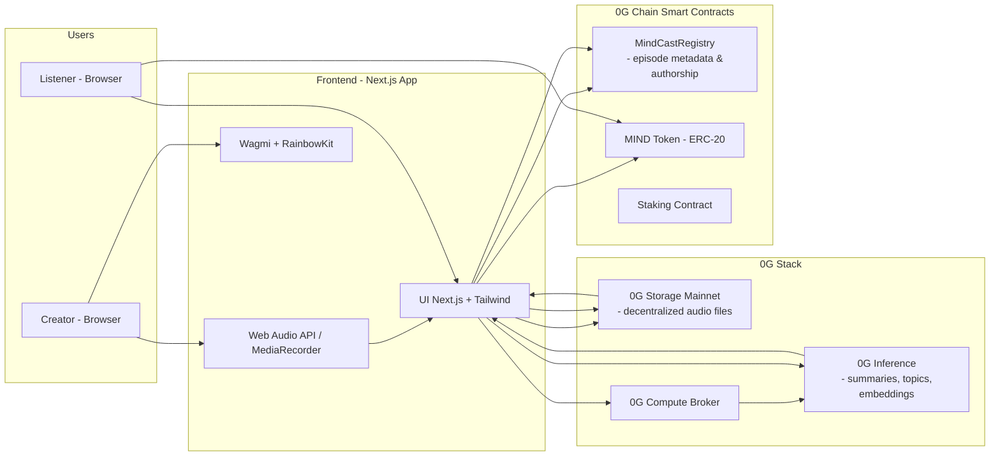

# 🎙️ MindCast — Decentralized Podcast & Knowledge Streaming Platform


**MindCast** is a decentralized Web3 podcasting and knowledge-streaming platform where creators can **record, upload, analyze, publish, and monetize audio content fully on-chain** using the 0G stack.

All audio, metadata, and AI analysis are stored or verified on-chain, offering **verifiable authorship**, **AI-enhanced discovery**, and a **complete token economy** for both creators and listeners.

---

# 🌟 Features

## 🎤 For Creators

* **Record & Upload:** High-quality in-browser audio recording
* **AI-Powered Insights:** Summaries, topics & embeddings via 0G Inference
* **On-Chain Storage:** Permanent decentralized storage on 0G Storage Mainnet
* **Token Monetization:** Earn **MIND** tokens for publishing + engagement
* **Direct Tipping:** Receive MIND or other tokens from listeners
* **Proof of Authorship:** Immutable, on-chain intellectual provenance
* **Creator Dashboard:** Analytics, earnings, and listener statistics
* **Premium Tools (Staking):** Unlock advanced features via staking

## 🎧 For Listeners

* **Decentralized Streaming:** Low-latency streaming directly from 0G Storage
* **AI Summaries:** Quickly understand episode content
* **Verified Authenticity:** Check creator signatures and metadata
* **Earn Rewards:** Engagement-based MIND token incentives
* **Support Creators:** Tips, boosts, and subscription features
* **AI-Curated Feed:** Personalized recommendations using embeddings

---

# 🏗️ Architecture



---

## 🧠 Data Pipeline Overview

1. **🎙️ Record:** Creator records audio in-browser
2. **📤 Upload:** Audio uploaded to **0G Storage Mainnet**
3. **🧠 AI Analysis:** 0G Inference generates summaries, topics & embeddings
4. **⛓️ On-Chain Publishing:** Registry stores metadata + proof of authorship
5. **💰 Rewards:** Creator receives automatic **MIND token** rewards
6. **🎧 Playback:** Listeners stream directly from decentralized storage
7. **❤️ Engagement:** Tips, engagement rewards, and staking incentives

---

# 🧱 Components

## 🎨 Frontend

* **Next.js 14 (App Router)**
* **Tailwind CSS**
* **Web Audio API / MediaRecorder API**
* **Wagmi + RainbowKit** for wallet connections
* Custom UI design system

## 🔗 Smart Contract Ecosystem

* **MindCastRegistry:** Stores metadata, provenance, manages tipping
* **MindCastToken (MIND):** ERC-20 token powering the economy
* **Staking Contract:** Unlock premium creator/listener features
* **Network:** 0G Chain Mainnet (EVM Compatible)

## 📦 Storage & AI

* **0G Storage Mainnet:** Permanent, decentralized file storage
* **0G Inference Engine:** AI-powered summaries & semantic extraction
* **Supports:** WAV, MP3, WebM, FLAC

---

# 🚀 Quick Start

## 🔧 Prerequisites

* Node.js 18+
* MetaMask or Web3 wallet
* 0G Mainnet ETH for gas

## 📥 Installation

```bash
git clone https://github.com/blockend-dev/mindcast.git
cd mindcast
npm install
```

### ⚙️ Environment Variables

```bash
cp .env.example .env.local
```

Edit `.env.local`:

```env
NEXT_PUBLIC_WC_PROJECT_ID=walletProjectID
OG_RPC_URL=https://evmrpc.0g.ai
INDEXER_RPC=https://indexer-storage-turbo.0g.ai
T_PRIVATE_KEY=yourTestnetPrivateKey
PRIVATE_KEY=yourMainnetPrivateKey
```

## ▶️ Run Dev Server

```bash
npm run dev
```

Open:

```
http://localhost:3000
```

---

# 💰 Token Economy — MIND Token

## 📌 Overview

* **Symbol:** MIND
* **Total Supply:** 1,000,000,000
* **Network:** 0G Chain
* **Type:** ERC-20

## 🪙 Reward Mechanics

### **Creator Rewards**

* **+100 MIND** per published episode
* **+50 MIND** for premium content drops
* **Engagement bonuses** based on listener activity

### **Listener Rewards**

* **+5 MIND** daily engagement
* **+2 MIND** for discovering new creators
* **+3 MIND** for sharing episodes

### **Tipping**

* Instant on-chain tipping using MIND or any ERC-20

---

# 🔒 Staking Benefits

| Tier      | Stake Amount | Benefits                          |
| --------- | ------------ | --------------------------------- |
| **Basic** | 100 MIND     | Premium analytics                 |
| **Pro**   | 1,000 MIND   | Early feature access + boosts     |
| **Elite** | 10,000 MIND  | Governance rights + revenue share |

---

# 📱 Usage Guide

## 📝 Creating a Podcast

1. **Connect Wallet** → authenticate
2. **Record Audio** → browser microphone
3. **AI Processing** → summary & topics
4. **Publish On-Chain** → confirm transaction
5. **Earn Rewards** → receive MIND

## 🎧 Listening & Earning

* Stream audio from 0G Storage
* View AI summaries
* Earn MIND for engagement
* Tip creators

---

# 🧰 Key Technologies

* **0G Chain Mainnet** (EVM)
* **0G Storage Mainnet**
* **0G Inference Engine**
* Ethers.js, Wagmi, RainbowKit
* Next.js 14, TypeScript, Tailwind CSS
* Web Audio API, MediaRecorder

---

# 🤝 Contributing

We welcome contributions!
Read the [CONTRIBUTING.md](CONTRIBUTING.md) for:

* Branching strategy
* Coding standards
* PR guidelines

---

# 📄 License

MIT License — see [LICENSE](LICENSE).

---

# 🎉 Join the Decentralized Audio Revolution

MindCast is redefining how audio content is created, published, and discovered.
With **0G Mainnet**, **AI-native features**, and a **robust token economy**, the future of decentralized podcasting is here.

**Build with us. Earn with us. Grow with us.**
*Decentralizing audio, one mind at a time.*

---
